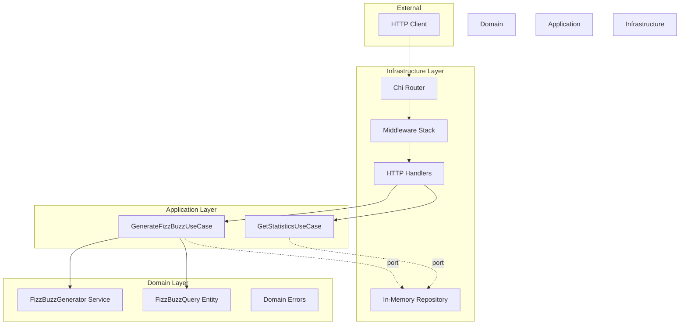
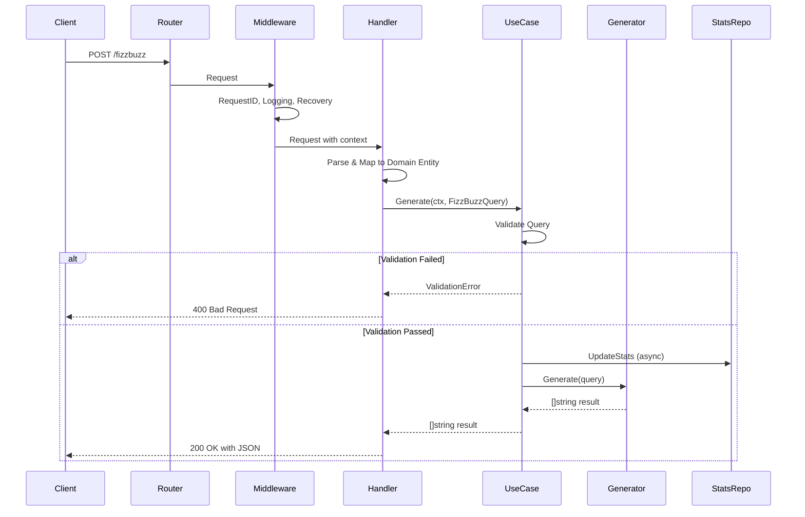
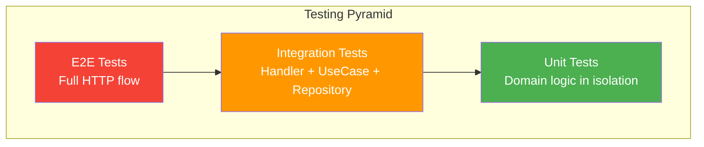
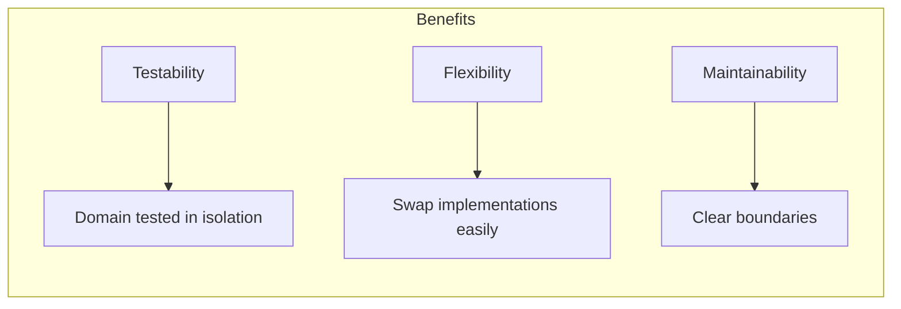

# FizzBuzz REST API Service

A production-ready, customizable FizzBuzz REST API with statistics tracking, built following **Clean Architecture** principles and **Domain-Driven Design** patterns.

## Table of Contents

- [Overview](#overview)
- [Quick Start](#quick-start)
- [Architecture](#architecture)
- [API Documentation](#api-documentation)
- [Testing Strategy](#testing-strategy)
- [Project Structure](#project-structure)
- [Configuration](#configuration)
- [Design Decisions](#design-decisions)

---

## Overview

This service exposes a REST API that generates customizable FizzBuzz sequences and tracks usage statistics. It demonstrates:

- **Clean Architecture** with clear separation of concerns
- **Domain-Driven Design** with rich domain entities
- **Comprehensive testing** at unit, integration, and E2E levels
- **Production-ready** configuration with graceful shutdown, structured logging, and health checks
- **OpenAPI/Swagger documentation** for API specification and interactive exploration

### Features

| Feature | Description |
|---------|-------------|
| Customizable FizzBuzz | Configure divisors, strings, and limit |
| Statistics Tracking | Track and retrieve the most frequent request |
| Health Check | Kubernetes/Docker-ready health endpoint |
| Structured Logging | JSON logging with request tracing |
| Graceful Shutdown | Clean connection draining on SIGTERM |
| **Swagger Documentation** | **Interactive API documentation and testing** |

---

## Quick Start

### Prerequisites

- Go 1.24+ or Docker
- (Optional) swagger CLI for generating API docs

### Run Locally

```bash
# Clone and run
make run

# Or with Go directly
go run cmd/server/main.go
```

### Run with Docker

```bash
# Build and run
make docker-run

# Or manually
docker-compose up --build
```

### Verify Installation

```bash
# Health check
curl http://localhost:8080/health

# Generate FizzBuzz
curl -X POST http://localhost:8080/fizzbuzz \
  -H "Content-Type: application/json" \
  -d '{"int1": 3, "int2": 5, "limit": 15, "str1": "fizz", "str2": "buzz"}'

# Get statistics
curl http://localhost:8080/statistics
```

---

## Architecture

This project follows **Hexagonal Architecture** (also known as Ports & Adapters), ensuring the business logic remains independent of external concerns.

### High-Level Architecture

> **Note**: If the Mermaid diagram below doesn't render on your device, please view it on the web at [https://github.com/KoHorizon/fizzbuzz-server](https://github.com/KoHorizon/fizzbuzz-server)



### Request Flow

> **Note**: If the Mermaid diagram below doesn't render on your device, please view it on the web at [https://github.com/KoHorizon/fizzbuzz-server](https://github.com/KoHorizon/fizzbuzz-server)



### Layer Responsibilities

| Layer | Responsibility | Dependencies |
|-------|---------------|--------------|
| **Domain** | Business rules, entities, domain services | None (pure Go) |
| **Application** | Use case orchestration, ports definition | Domain only |
| **Infrastructure** | HTTP, persistence, configuration | Application, Domain |

---

## API Documentation

### Interactive Documentation with Swagger

This project includes **OpenAPI 2.0 (Swagger)** documentation for interactive API exploration.

#### Generate Swagger Documentation

```bash
# Install swagger CLI (first time only)
go install github.com/go-swagger/go-swagger/cmd/swagger@latest

# Generate swagger.json and swagger.yaml
make swagger
```

**Note on Generated Files**: The generated `swagger.json` and `swagger.yaml` files are committed to this repository to facilitate easier review and immediate API exploration. In a production environment, these would typically be generated during the CI/CD pipeline and not committed to version control.

#### View Interactive Documentation

```bash
# Serve Swagger UI at http://localhost:8081/docs
make swagger-serve
```

The Swagger UI allows you to:
- **Browse all API endpoints** with detailed descriptions
- **View request/response schemas** with examples
- **Try out API calls** directly from the browser
- **Download OpenAPI spec** in JSON or YAML format

#### Manual API Reference

For detailed Swagger setup and usage, see [docs/SWAGGER.md](docs/SWAGGER.md).

### POST /fizzbuzz

Generates a customizable FizzBuzz sequence.

**Request Body:**

```json
{
  "int1": 3,
  "int2": 5,
  "limit": 15,
  "str1": "fizz",
  "str2": "buzz"
}
```

| Parameter | Type | Constraints | Description |
|-----------|------|-------------|-------------|
| `int1` | integer | > 0 | First divisor |
| `int2` | integer | > 0 | Second divisor |
| `limit` | integer | > 0, ≤ 10000 | Upper bound (inclusive) |
| `str1` | string | non-empty | Replacement for multiples of int1 |
| `str2` | string | non-empty | Replacement for multiples of int2 |

**Success Response (200):**

```json
{
  "result": ["1", "2", "fizz", "4", "buzz", "fizz", "7", "8", "fizz", "buzz", "11", "fizz", "13", "14", "fizzbuzz"]
}
```

**Validation Error (400):**

```json
{
  "error": "invalid parameters",
  "details": [
    "int1 must be greater than 0",
    "str2 cannot be empty"
  ]
}
```

### GET /statistics

Returns the most frequently requested FizzBuzz configuration.

**Success Response (200):**

```json
{
  "most_frequent_request": {
    "int1": 3,
    "int2": 5,
    "limit": 15,
    "str1": "fizz",
    "str2": "buzz"
  },
  "hits": 42
}
```

**No Requests Yet (200):**

```json
{
  "most_frequent_request": null,
  "hits": 0
}
```

### GET /health

Returns service health status.

**Response (200):**

```json
{
  "status": "healthy"
}
```

---

## Testing Strategy

The project implements a **Testing Pyramid** approach with three distinct levels:

> **Note**: If the Mermaid diagram below doesn't render on your device, please view it on the web at [https://github.com/KoHorizon/fizzbuzz-server](https://github.com/KoHorizon/fizzbuzz-server)



### Test Categories

| Level | Location | Purpose | Dependencies |
|-------|----------|---------|--------------|
| **Unit** | `test/unit/` | Test domain logic in isolation | Mocks only |
| **Integration** | `test/integration/` | Test component interactions | Real implementations, no network |
| **E2E** | `test/e2e/` | Test full HTTP flow | Real HTTP server |

### Running Tests

```bash
# All tests
make test

# With race detection (recommended for CI)
make test-race

# With coverage report
make test-coverage

# Specific levels
make test-unit
make test-integration
make test-e2e
```

### Test Coverage Goals

- **Domain Layer**: 100% coverage (critical business logic)
- **Application Layer**: >90% coverage (use case orchestration)
- **Infrastructure Layer**: >80% coverage (HTTP handlers, repository)

### Key Testing Patterns Used

1. **Table-Driven Tests**: Comprehensive input coverage with minimal code duplication
2. **Test Doubles**: Mocks for ports to isolate unit tests
3. **Parallel Safe**: All tests use proper synchronization
4. **Benchmark Tests**: Performance verification for the generator

---

## Project Structure

```
fizzbuzz-service/
├── cmd/
│   └── server/
│       └── main.go                 # Application entry point & DI wiring
├── docs/
│   ├── swagger.go                  # Swagger package-level annotations
│   ├── SWAGGER.md                  # Swagger documentation guide
│   ├── swagger.json                # Generated OpenAPI spec (JSON)
│   └── swagger.yaml                # Generated OpenAPI spec (YAML)
├── internal/
│   ├── domain/                     # Core business logic (no dependencies)
│   │   ├── entity/
│   │   │   ├── fizzbuzz.go         # FizzBuzzQuery entity + validation
│   │   │   └── statistics.go       # Statistics DTOs
│   │   ├── service/
│   │   │   └── fizzbuzz_generator.go  # Core algorithm
│   │   └── errors.go               # Domain-specific errors
│   ├── application/                # Use cases (orchestration)
│   │   ├── generate_fizzbuzz.go    # Generate sequence use case
│   │   └── get_statistics.go       # Get stats use case
│   └── infrastructure/             # External concerns
│       ├── config/
│       │   └── config.go           # Environment configuration
│       ├── http/
│       │   ├── handler/            # HTTP request handlers (with Swagger annotations)
│       │   ├── middleware/         # Logging, recovery
│       │   └── router.go           # Route definitions
│       ├── persistence/
│       │   └── inmemory/           # In-memory statistics storage
│       └── server/
│           └── server.go           # HTTP server with graceful shutdown
├── test/
│   ├── unit/                       # Unit tests
│   ├── integration/                # Integration tests
│   └── e2e/                        # End-to-end tests
├── Dockerfile                      # Multi-stage production build
├── docker-compose.yml              # Local development setup
├── Makefile                        # Development commands (includes swagger targets)
└── README.md                       # This file
```

---

## Configuration

All configuration is done via environment variables:

| Variable | Default | Description |
|----------|---------|-------------|
| `PORT` | `8080` | HTTP server port |
| `LOG_LEVEL` | `info` | Log level (debug, info, warn, error) |
| `MAX_LIMIT` | `10000` | Maximum allowed limit parameter |

### Production Timeouts

The server is configured with production-ready timeouts to prevent resource exhaustion:

| Timeout | Value | Purpose |
|---------|-------|---------|
| Read | 5s | Maximum time to read request body |
| Read Header | 2s | Maximum time to read request headers |
| Write | 10s | Maximum time to write response |
| Idle | 120s | Keep-alive connection timeout |
| Shutdown | 10s | Graceful shutdown grace period |

---

## Design Decisions

### Why Clean Architecture?

> **Note**: If the Mermaid diagram below doesn't render on your device, please view it on the web at [https://github.com/KoHorizon/fizzbuzz-server](https://github.com/KoHorizon/fizzbuzz-server)



1. **Independent of frameworks**: The domain layer has zero external dependencies
2. **Testable**: Business logic can be tested without HTTP or database concerns
3. **Flexible**: Infrastructure can be swapped (e.g., Redis for in-memory) without touching business logic

### Why Asynchronous Statistics Updates?

Statistics are updated in a goroutine to ensure:
- The main request is not blocked by statistics operations
- Statistics failures don't impact the primary FizzBuzz functionality
- Better response times under high load
- Updates complete even if the HTTP request finishes early (using detached context)
```go
// Non-blocking statistics update with detached context
go func() {
    // Create a new context with timeout, not tied to the request
    ctx, cancel := context.WithTimeout(context.Background(), 5*time.Second)
    defer cancel()
    
    if err := uc.statsUpdater.UpdateStats(ctx, query); err != nil {
        uc.logger.Error("failed to update statistics",
            "error", err,
            "query_key", query.Key(),
        )
    }
}()
```

**Why use `context.Background()` instead of the request context?**
The statistics update runs asynchronously and should complete even if the HTTP request is cancelled or times out. Using a detached context with its own timeout ensures reliability while preventing runaway goroutines.

### Why Include All Parameters in Statistics Key?

The statistics key includes all 5 parameters (`int1:int2:limit:str1:str2`) because:
- Each unique combination represents a distinct user intent
- Allows accurate tracking of request patterns
- Prevents false aggregation of different use cases

### Why POST Instead of GET for FizzBuzz?

While GET would be semantically correct (idempotent, safe), POST was chosen because:
- Query strings become unwieldy with 5 parameters
- Easier input validation with JSON body
- No URL length limitations
- Cleaner API for complex parameters (strings with special characters)

### Why go-swagger?

go-swagger was chosen for API documentation because:
- **Code-first approach**: Documentation lives with the code
- **Type safety**: Generates specs from actual Go types
- **Standard compliance**: Produces OpenAPI 2.0 specs
- **Tooling support**: Interactive Swagger UI, validation, client generation
- **No runtime overhead**: Documentation is generated at build time

---

## Development Commands

```bash
make help             # Show all available commands
make run              # Run locally
make test             # Run all tests
make test-coverage    # Generate coverage report
make lint             # Run linter (requires golangci-lint)
make fmt              # Format code
make swagger          # Generate Swagger documentation
make swagger-serve    # Serve interactive Swagger UI
make swagger-validate # Validate Swagger spec
make docker-run       # Run with Docker Compose
make clean            # Clean build artifacts
```

---

## License

This project is an just an example of a possible implementations production grade architecture.

---
